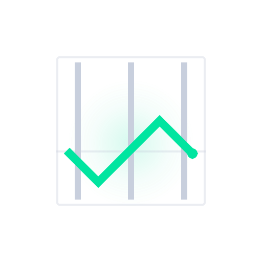
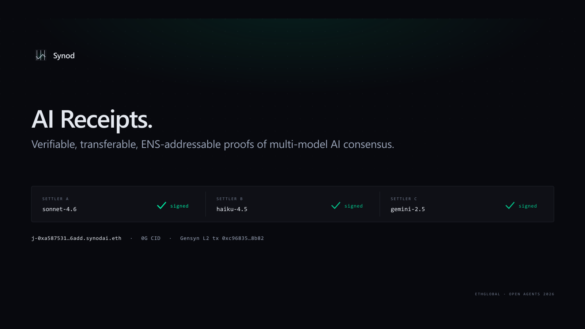
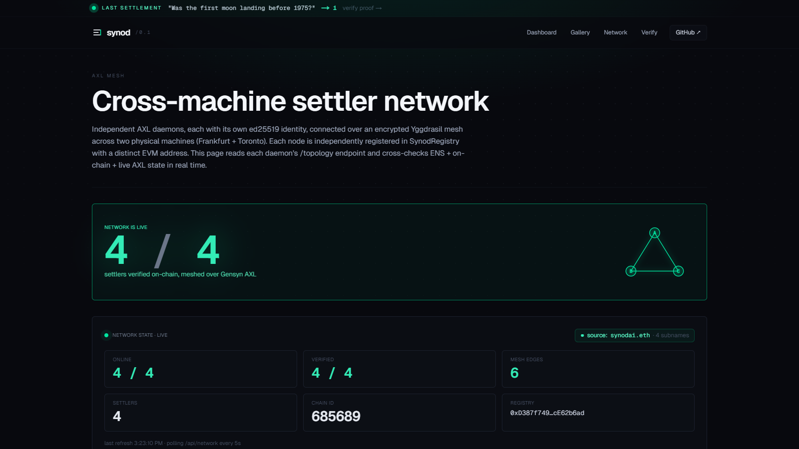
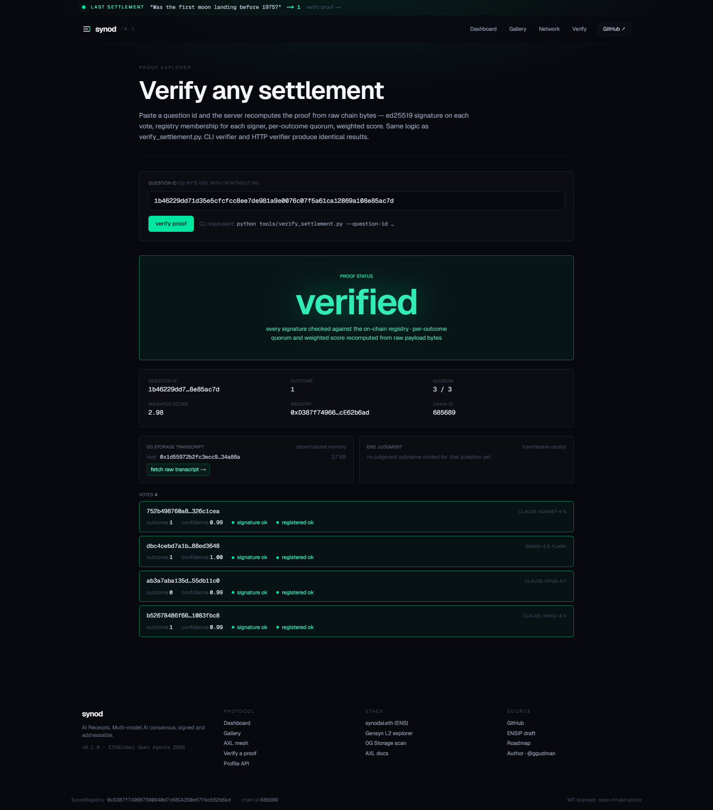
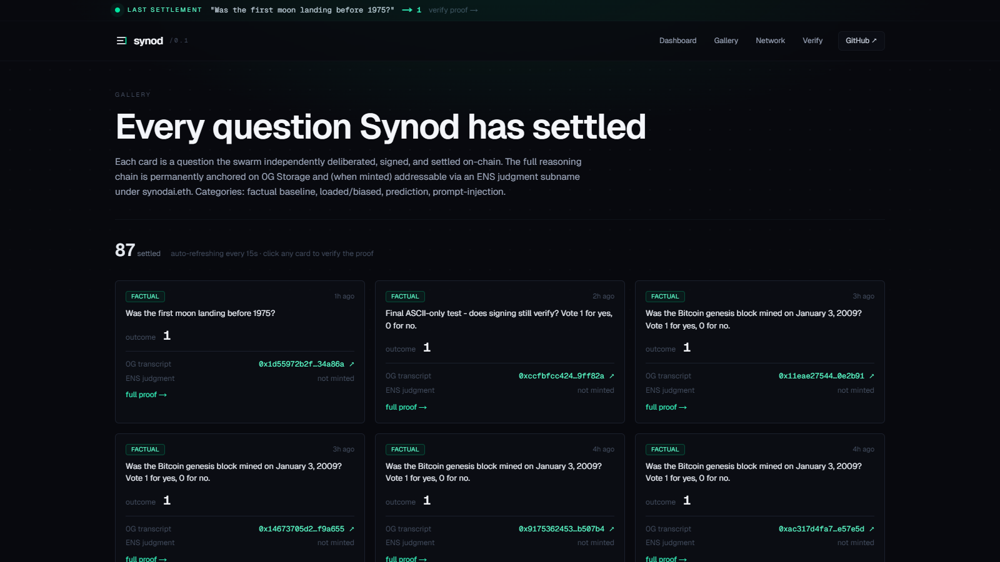

<div align="center">



# Synod

**AI Receipts — verifiable, transferable, ENS-addressable, 0G-anchored proofs of multi-model AI consensus.**

[](https://github.com/Ridwannurudeen/synod/actions/workflows/ci.yml)
[](https://ethglobal.com/events/openagents)
[](https://synod.gudman.xyz)
[](./LICENSE)

[**Live Demo**](https://synod.gudman.xyz) · [**Verify a Settlement**](https://synod.gudman.xyz/verify) · [**Network Status**](https://synod.gudman.xyz/network) · [**Gallery**](https://synod.gudman.xyz/gallery)



</div>

---

## Overview

Synod is a network of heterogeneous AI agents that deliberate, sign, and settle questions. Four settlers running on two physical machines (Anthropic Sonnet 4.6, Anthropic Haiku 4.5, Google Gemini 2.5 Flash, Anthropic Opus 4.7) reach consensus over the **Gensyn AXL** encrypted P2P mesh, sign their votes with ed25519, and anchor the canonical settlement on **Gensyn L2**. Every deliberation transcript persists to **0G Storage**, every verdict mints as a transferable **ENS subname** (`j-{hash}.synodai.eth`) owned by the question submitter, and the entire registry — contract address, RPC, chain id, threshold, settler set — bootstraps from a single ENS name (`synodai.eth`).

When one AI calls the outcome, you trust one company. With Synod, you trust a network — and the network leaves a cryptographically anchored receipt every time it speaks.

## Screenshots

### Live Network — 4 settlers across 2 physical VPS, ENS-resolved



The `/network` page reads each AXL daemon's `/topology`, the `SynodRegistry` on Gensyn L2, and `synodai.eth` text records on Ethereum mainnet — a green status requires all three to agree.

### Judgment Receipt — independently verifiable proof



Each settled question gets a full proof: ed25519 signature on every vote, registry-membership check, recomputed per-outcome quorum, weighted-score re-derivation, 0G Storage transcript root, and the optional `j-{hash}.synodai.eth` judgment subname.

### Gallery — every question Synod has settled



Every settled question is permanently anchored on Gensyn L2 and addressable via the public verifier. Categories include factual, loaded/biased, prediction, and prompt-injection — each settler's reasoning is on 0G Storage, the verdict is one ENS lookup away.

## Features

- **AXL-native swarm.** Settlers communicate exclusively over the Gensyn AXL Yggdrasil mesh — no central coordinator, no fallback transport. Cross-machine: 3 settlers in Frankfurt, 1 in Toronto, bidirectional mesh over public IP.
- **Multi-model consensus.** Two providers across four model variants (Anthropic Sonnet/Haiku/Opus, Google Gemini). Per-outcome quorum with confidence-weighted scoring; the deterministic poster (lowest hex pubkey) submits to chain.
- **ENS as runtime bootloader.** `synodai.eth` text records hold the registry contract address, chain id, RPC, and quorum threshold. Edit a record, the live UI swings — verified during the hackathon by flipping `synod.threshold` from `2` to `3`.
- **Transferable AI receipts.** Each verdict mints `j-{hash}.synodai.eth` via NameWrapper. Owner is the verified question submitter, not the operator. Tradeable like any ENS NFT.
- **0G Storage transcripts.** Full deliberation transcript for every settlement, retrievable by pure HTTP — no SDK, no auth, no key. 175 KB+ persisted across 100+ settlements.
- **ERC-7857 iNFTs.** All 4 settlers minted as iNFTs on 0G Chain Galileo with a verified live transfer.
- **Independent verifier.** TypeScript (`ui/lib/proof-verifier.ts`) and Python CLI (`settler/tools/verify_settlement.py`) recompute every check from raw chain bytes. No trust in the UI or operator required.
- **Slashing demo on 0G.** v1.1 SynodRegistry with optimistic challenge window and bond slashing — full lifecycle demoed end-to-end on 0G Galileo (5 real on-chain txs, `voided=true`, 0.001 OG slashed).

## What's Shipped (verifiable on-chain)

| Layer | Network | Address / Reference |
|---|---|---|
| Settlement contract | Gensyn L2 mainnet (chain `685689`) | [`SynodRegistry @ 0xD387…b6ad`](https://gensyn-mainnet.explorer.alchemy.com/address/0xD387f749667590940d7c68CA350e57FbcE62b6ad) |
| Identity bootloader | Ethereum mainnet | [`synodai.eth`](https://app.ens.domains/synodai.eth) + 4 settler subnames |
| Judgment receipts | Ethereum mainnet | [`j-67b3d12.synodai.eth`](https://app.ens.domains/j-67b3d12.synodai.eth) (submitter-owned) + 2 more |
| Transcripts | 0G Storage Galileo | HTTP retrieval at `https://indexer-storage-testnet-turbo.0g.ai/file?root=0x…` |
| Agent NFTs | 0G Chain Galileo (chain `16602`) | [`AgentNFT @ 0x4fF6…2D85`](https://chainscan-galileo.0g.ai/address/0x4fF6712B364A06f4f23878dE3c4678E8F48f2D85) — 4 minted, 1 transferred |
| v1.1 registry + slashing | 0G Galileo | [`0x1dbe…3BF`](https://chainscan-galileo.0g.ai/address/0x1dbe19EbF48b41b0E2DA16BA1B36136abab373BF) |

First mainnet settlement: [`0xc96835…8b82`](https://gensyn-mainnet.explorer.alchemy.com/tx/0xc96835176b03b91e13907bab612ebdf79a0d5fe60647c76f2d6b06fa46ab8b82) · 100+ `SettlementRecorded` events on Gensyn L2.

## Architecture

```
                          ┌──────────────────────────────┐
                          │   1. Question announcement   │
                          │   (creator → primary node)   │
                          └──────────────┬───────────────┘
                                         │ AXL P2P
              ┌──────────────────────────┴──────────────────────────┐
              ▼                          ▼                          ▼
   ┌──────────────────┐    ┌──────────────────┐    ┌──────────────────┐
   │  Settler A       │    │  Settler B       │    │  Settler C / D   │
   │  Sonnet 4.6      │    │  Haiku 4.5       │    │  Gemini / Opus   │
   │  AXL ed25519 id  │    │  AXL ed25519 id  │    │  AXL ed25519 id  │
   │  EVM signer      │    │  EVM signer      │    │  EVM signer      │
   └────────┬─────────┘    └────────┬─────────┘    └────────┬─────────┘
            │                       │                       │
            │   2. Independent inference + signed vote      │
            │                       │                       │
            └────────── AXL P2P encrypted broadcast ────────┘
                                    │
                                    │  3. Confidence-weighted consensus
                                    │
                                    ▼
                  ┌─────────────────────────────────┐
                  │  4. Designated poster (lowest    │
                  │     pubkey) submits to chain     │
                  └────────────────┬────────────────┘
                                   ▼
                  ┌─────────────────────────────────┐
                  │   SynodRegistry @ Gensyn L2      │
                  │   recordSettlement(qid, outcome, │
                  │     quorum, score, signedVotes)  │
                  └────────────────┬────────────────┘
                                   │
                                   ▼
                  ┌─────────────────────────────────┐
                  │  5. Transcript → 0G Storage      │
                  │  6. Judgment subname → ENS       │
                  └─────────────────────────────────┘
```

## Tech Stack

| Layer | Implementation |
|---|---|
| P2P transport | [Gensyn AXL](https://github.com/gensyn-ai/axl) — Yggdrasil mesh, ed25519 keys, end-to-end encryption |
| Settler agents | Python 3.11+, Anthropic SDK, Google Gemini SDK, ed25519 via `cryptography` |
| Consensus | Per-outcome confidence-weighted quorum, deterministic poster, dedup-by-settler |
| Smart contracts | Solidity 0.8.24, Foundry, OP-Stack-compatible (Gensyn L2 chain `685689`) |
| Frontend | Next.js 16, React 19, Tailwind v4, viem |
| Storage | 0G Storage Galileo (`0g-storage-client` Go binary) |
| Identity | ENS NameWrapper + PublicResolver multicall on Ethereum mainnet |
| Agent NFTs | ERC-7857 (0G Labs reference impl on 0G Chain Galileo) |

## Verify a Settlement Live (30 seconds)

```bash
# 1. ENS bootloader — registry + RPC + threshold + 4 settler subnames
curl -s https://synod.gudman.xyz/api/ens | jq '{source, parent, subnames: (.subnames | length)}'

# 2. Live AXL mesh + 4 settlers across two physical VPS
curl -s https://synod.gudman.xyz/api/network | \
  jq '.nodes[] | {name: .spec.name, online, registered, ensOK: .pubkeyMatchesEns}'

# 3. Recompute a v2 signed-vote proof end-to-end
curl -s -X POST -H 'Content-Type: application/json' \
  -d '{"questionId":"0x67b3d126ba9213433f6c4d268946b00d91cb608b5bffdcf5d1e59f37b141b069"}' \
  https://synod.gudman.xyz/api/verify-proof | jq '{status, votes: (.votes | length)}'

# 4. Resolve a submitter-owned judgment subname (NOT the operator)
cast resolve-name j-67b3d12.synodai.eth
# NameWrapper.ownerOf returns 0x81Ef2F237Cf51aa8c4b1FFd3062046e651be39f0

# 5. Pull a full deliberation transcript from 0G Storage by HTTP
curl -s 'https://indexer-storage-testnet-turbo.0g.ai/file?root=0x168964fb768573420c8bd434c5f6a5216e334a60515b53bd3f6f12e74a4f3775' \
  | jq '.votes | length'
```

## Quick Start

Prerequisites: Node 22+, Go 1.25.5+ (auto-fetched via `GOTOOLCHAIN`), Foundry, Python 3.11+.

```bash
# 1. Build the AXL daemon
git clone https://github.com/gensyn-ai/axl
cd axl && GOTOOLCHAIN=go1.25.5 go build -o ../axl/axl-node ./cmd/node/

# 2. Build SynodRegistry + run Foundry tests
cd contracts && forge install foundry-rs/forge-std --no-commit && forge test

# 3. Set up the settler runtime
cd settler && python -m venv .venv && .venv/bin/pip install -r requirements.txt
cp .env.example .env  # add ANTHROPIC_API_KEY

# 4. Generate AXL identities
bash scripts/axl-keygen.sh node-a
bash scripts/axl-keygen.sh node-b

# 5. Run the full demo (UI on :3000)
bash tools/demo-up.sh
```

For a three-vendor local demo (Anthropic + OpenAI + Google), see [`docs/judge-demo.md`](docs/judge-demo.md):

```bash
python tools/demo-doctor.py --demo 3node --with-tests
bash tools/demo-up-3node.sh
```

## Try the SDK

```bash
npm i github:Ridwannurudeen/synod#main
```

The package lives in [`sdk/`](sdk/) and is intentionally **unpublished on npm during the hackathon** — install directly from the GitHub repo. `cd sdk && npm test` runs 9 smoke tests against the live deployment.

## Project Structure

```
synod/
├── contracts/        Foundry workspace — SynodRegistry.sol + tests
├── settler/          Python settler agent — protocol, identity, AXL client, on-chain submitter
│   ├── synod_settler/
│   │   ├── agent.py            inference loop
│   │   ├── consensus.py        per-outcome quorum + weighted score
│   │   ├── identity.py         ed25519 keypair + EVM signer
│   │   ├── axl_client.py       AXL daemon HTTP wrapper
│   │   ├── onchain.py          web3.py → Gensyn L2
│   │   ├── storage_0g.py       0G Storage CLI wrapper
│   │   └── judgment_ens.py     ENS judgment subname mint
│   └── tools/
│       └── verify_settlement.py    independent CLI proof verifier
├── ui/               Next.js 16 frontend + 12 API routes
├── sdk/              TypeScript SDK (smoke-tested against live deploy)
├── axl/              AXL daemon binaries + MCP sidecar
├── docs/             Submissions, ENSIP draft, demo theater, architecture spec
└── tests/            Cross-package integration tests
```

## Tests

**83 tests green** — 37 Python (protocol, identity, consensus, on-chain, proof-verifier, including v2 reasoning-hash binding and canonical-confidence regression), 37 Solidity Foundry (including 256-run fuzz), 9 TypeScript SDK smoke tests against the live deployment, plus 42 MCP sidecar tests with mocked AXL daemon.

## Scope: v1 vs v1.1

v1 ships a tight, honest hackathon build. The v1.1 list is the **post-hackathon roadmap** for the Gensyn Foundation grant fast-track.

| Concern | v1 (shipped) | v1.1 (designed) |
|---|---|---|
| Quorum/arithmetic enforcement | Off-chain in `proof-verifier`. Bond + challenge window deters fraud economically. | EIP-712 aggregation enforced on-chain |
| Reasoning binding | Protocol v2: `reasoning_hash` bound into the ed25519 signing payload. The reasoning text must hash to the signed `reasoning_hash` or the verifier rejects. | (closed — v2 live) |
| Verification durability | Verifier reads current registry state. | Block-height-pinned verification using `eth_getLogs(SettlerRegistered)` |
| Judgment subname ownership | SIWE-style signed owner-declaration → `viem.verifyMessage` → 3-tx mint pipeline transfers to submitter. | (closed) |
| Provider heterogeneity | Two providers, four models. Same SYSTEM_PROMPT — heterogeneity on the vendor/model axis. | Specialised analyst/skeptic/synthesizer prompts per role |
| ERC-7857 verifier | Stub `IERC7857DataVerifier` returns `isValid=true`. Mint + transfer flows real on 0G Galileo. | TEE attestation + sealed-key encryption pipeline |
| Stats source | `/api/stats.questionsSettled` reads local 0G transcript index. | Switch to `eth_getLogs(SettlementRecorded)` |

Full details in [`ROADMAP.md`](ROADMAP.md).

## Documentation

- [`QUICKSTART.md`](QUICKSTART.md) — `make demo` local fork-and-run
- [`docs/SUBMISSIONS.md`](docs/SUBMISSIONS.md) — per-track ETHGlobal writeup
- [`docs/COMPARISON.md`](docs/COMPARISON.md) — Synod vs Chainlink, UMA, Pyth, Reality.eth, Bittensor
- [`docs/DEMO_THEATER.md`](docs/DEMO_THEATER.md) — demo video script
- [`docs/ENSIP-DRAFT-AI-AGENT-IDENTITY.md`](docs/ENSIP-DRAFT-AI-AGENT-IDENTITY.md) — proposed ENS standard for AI agent identity
- [`docs/grant-security-model.md`](docs/grant-security-model.md) — grant-honest security model
- [`docs/SLASHING_DEMO.md`](docs/SLASHING_DEMO.md) — v1.1 slashing demo run on 0G Galileo
- [`docs/FEEDBACK_AXL.md`](docs/FEEDBACK_AXL.md) · [`docs/FEEDBACK_ENS.md`](docs/FEEDBACK_ENS.md) · [`docs/FEEDBACK_0G.md`](docs/FEEDBACK_0G.md) — sponsor engineering feedback
- [`AI_USAGE.md`](AI_USAGE.md) — AI tool attribution per ETHGlobal rules
- [`sdk/README.md`](sdk/README.md) — TypeScript SDK reference

## Roadmap

Post-hackathon, into the Gensyn Foundation grant program:

- **Stake-based participation** — settlers stake $AI to register, slashed if they disagree with quorum
- **REE integration** — each settler's inference runs in Gensyn's Reproducible Execution Environment for bitwise-deterministic verifiability
- **Permissionless settler enrollment** — replace admin allowlist with $AI-stake-weighted set
- **Multi-outcome markets** — extend beyond binary outcomes
- **Direct Delphi integration** — work with Gensyn to expose a settler interface so Synod can serve live Delphi markets

## License

MIT. See [LICENSE](./LICENSE).

## Acknowledgments

Built for [ETHGlobal Open Agents 2026](https://ethglobal.com/events/openagents). Submitted to **Gensyn AXL**, **ENS** (Identity + Creative tracks), and **0G** (Track 2 Swarms).

Built on top of [Gensyn AXL](https://github.com/gensyn-ai/axl), [ENS NameWrapper](https://docs.ens.domains/wrapper/overview), [0G Storage](https://docs.0g.ai/), [Foundry](https://getfoundry.sh/), [Next.js](https://nextjs.org/), and [viem](https://viem.sh/).

---

<div align="center">

**[Live Demo](https://synod.gudman.xyz)** · **[GitHub](https://github.com/Ridwannurudeen/synod)** · **[ETHGlobal Submission](https://ethglobal.com/showcase)**

</div>
